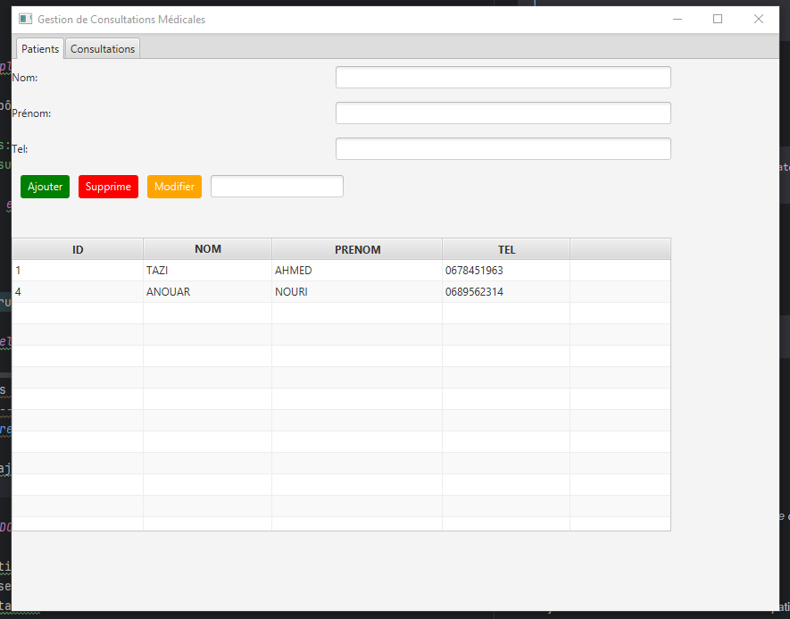

# 🏥 Application de Gestion des Consultations Médicales

Cette application JavaFX permet de gérer les **patients** et leurs **consultations médicales** à travers une interface graphique intuitive.

---

## 📌 Fonctionnalités

- 🔍 Rechercher, ajouter, supprimer ou modifier un **patient**
- 🗓️ Planifier une **consultation médicale**
- 🧾 Saisir une **description détaillée** pour chaque consultation
- 📊 Visualiser toutes les consultations dans un tableau
- 🧑‍⚕️ Interface en deux onglets : **Patients** et **Consultations**

---

## 🎯 Technologies utilisées

- **Java 17+**
- **JavaFX 23**
- **FXML** (structure de l’interface utilisateur)
- **Maven** ou **Gradle** (si utilisé)
- **Scene Builder** (optionnel)

---

## 📁 Structure du projet

## gestion-consultation/
```
│
├── src/
│ ├── main/
│ │ ├── java/
│ │ │ └── ma/enset/gestionconsultation/
│ │ │ ├── controllers/
│ │ │ │ ├── PatientController.java
│ │ │ │ └── ConsultationController.java
│ │ │ ├── models/
│ │ │ │ ├── Patient.java
│ │ │ │ └── Consultation.java
│ │ │ └── Main.java
│ │ └── resources/
│ │ ├── patients-view.fxml
│ │ ├── consultations-view.fxml
│ │ ├── main-view.fxml
│ │ └── styles.css (optionnel)
│
└── README.md
```

## ▶️ Lancer l'application

1. **Cloner le dépôt :**
   ```bash
   git clone https://github.com/votre-utilisateur/gestion-consultation.git
   cd gestion-consultation

## 🚀 Compiler et exécuter

### Avec Maven :

```bash
mvn clean javafx:run
```
## 📸 Aperçu visuel

| Onglet Patients                                                          | Onglet Consultations                           |
|--------------------------------------                                    |------------------------------------------------|
|                                       |  |


## ✅ À faire (TODO)

- Ajouter la fonctionnalité de modification d’un patient
- Intégrer une base de données (JDBC, JPA ou Hibernate)
- Ajouter l’exportation en PDF des consultations

---

## 🧑‍💻 Auteur

**Abdelkarim El Hajbi**  
Étudiant en Master Big Data & Cloud Computing  
📧 [abdelkarimelhajbi@gmail.com](mailto:abdelkarimelhajbi@gmail.com)  
🌐 [GitHub](https://github.com/Elhajbi) • [LinkedIn](https://www.linkedin.com/in/abdelkarim-el-hajbi-65b783160/)

